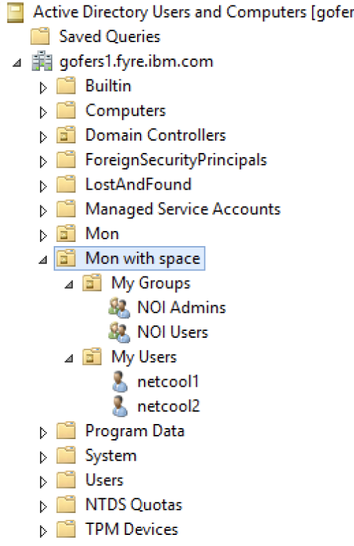
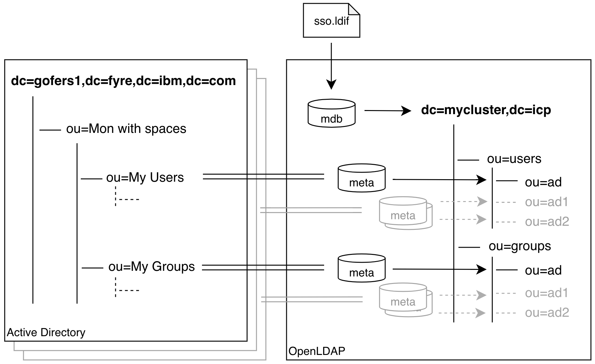
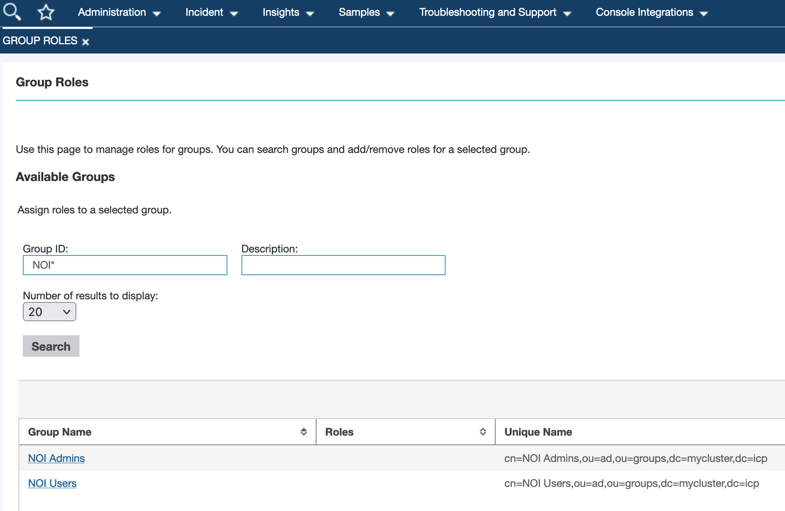

# Configuring OpenLdap container to support any structure of corporate LDAP server (for Watson AIOps v3.1.1 and v3.2)

There is a requirement for NOI v1.6.3 to have certain LDAP structure at the corporate LDAP server: [Creating users on an external LDAP server](https://www.ibm.com/docs/en/noi/1.6.3?topic=users-creating-external-ldap-server). Following the documentation we need to have groups in `ou=groups,LDAP_SUFFIX` and users in `ou=users,LDAP_SUFFIX` as well as have administrative users like "impactadmin" exactly named. Some customers are not ready of the approach and request to have administrative users placed at another LDAP branch or even different LDAP domains and named with their style. Also, they're not ready to change their domain structure because of inability to adjust security automations and policies for each application or solution they might currently use.

The instruction is about to make configuration of OpenLadp contaner that comes with cloud NOI to operate in "proxy" mode with corporate domain trees combined in a single virtual structure. The example explains how to have administrative users in a local db of OpenLDAP container. The local db is defined by file [imageFiles/sso.ldif](imageFiles/sso.ldif) which is inside container (all default passwords will be redefined automatically by NOI).

## Solution Overview

In the example, we have a prototype of LDAP domain (MS AD) with the following structure:



It is expected to grant access to NOI for users in `ou=My Users,ou=Mon with spaces,dc=gofers1,dc=fyre,dc=ibm,dc=com` branch, according to permissions assigned to their groups in `ou=My Groups,ou=Mon with spaces,dc=gofers1,dc=fyre,dc=ibm,dc=com`. We will use internal `mdb` database, which will hold the proxy domain `dc=mycluster,dc=icp`. The database is being populated during container startup from  [imageFiles/sso.ldif](imageFiles/sso.ldif) file. The database will contain limited number of administrative users required for internal NOI communication such as "impactadmin". Below is the target scheme of the solution:



To have integration with corporate LDAP (Active Directory in our case) we will use several `meta` databases which will proxy AD branches. Main difference between `ldap` and `meta` databases is ability of `meta` to masquerade branch names and merge them into a structure required by NOI components. It is evident we can use as many `meta` databases as we need to glue AD branches into sub-branch of our domain `dc=mycluster,dc=icp`, for example, `ou=ad1,ou=users,dc=mycluster,dc=icp` and `ou=ad2,ou=users,dc=mycluster,dc=icp`. This way we can differentiate users between original sources. In our example we will use virtual organizational unit `ou=ad`.

By default, OpenLdap can be deployed in "proxy" or "standalone" mode, none of them has `meta` backend. The solution assumes usage of custom CentOSv7 image for OpenLDAP container. The installation instruction guides to use already prepared and published container at `quay.io`. However there are [Dockerfile_cap](Dockerfile_cap) and [Dockerfile_nocap](Dockerfile_nocap) which were used to create appropriate images. Difference between them in ability to use linux capabilities which were allowed in NOI of Watson AIOps 3.1 and deprecated in NOI of Watson AIOps 3.2. The files can be customized with your needs.

## Installation

At the moment it is expected that Watson AIOps already installed and container version of NOI instance configured. During the instruction we expect working `oc` connected to the OpenShift cluster.

### Step 1 - Configuring "proxy" mode for OpenLDAP

It is recommended to switch to "proxy" mode by editing yaml of NOI instance:

``` bash
oc edit NOI/evtmanager -n waiops
```

where `evtmanager` is a name of NOI instance and `waiops` is a namespace where it is installed. The mode should be changed from "standalone" to "proxy" as below:

``` yaml
...
  ldap:
    baseDN: dc=mycluster,dc=icp
    bindDN: cn=admin,dc=mycluster,dc=icp
    groupFilter: cn=%s,ou=groups
    mode: proxy
    port: "389"
    serverType: CUSTOM
    sslPort: "636"
    storageClass: ""
    storageSize: 1Gi
    suffix: dc=mycluster,dc=icp
    url: ldap://localhost:389
    userFilter: uid=%s,ou=users
...
```

this change will trigger openldap stetefulset to recreate and pod to restart with new configuration. After the configuration you might find openldap pod in non-working state because of configuration is not finished.

### Step 2 - Configuring OpenLDAP

The main configuration file is [openldap/ldap-proxy-slapd-replace](openldap/ldap-proxy-slapd-replace) which will be used to start OpenLDAP application. We need to adjust the file according to corporate directory credentials. It is predefined to connect to AD from our example.

* Navigate to the meta database definition section for **"users"**:

``` bash
...
#######################################################################
# META Databases Definitions
#######################################################################

database        meta
suffix "ou=ad,ou=users,dc=mycluster,dc=icp"
rootdn "cn=admin,dc=mycluster,dc=icp"
overlay memberof
subordinate

uri ldap://9.30.45.43/ou=ad,ou=users,dc=mycluster,dc=icp
readonly      yes
lastmod       off
suffixmassage  "ou=ad,ou=users,dc=mycluster,dc=icp" "ou=My Users,ou=Mon with space,DC=gofers1,DC=fyre,DC=ibm,DC=com"
chase-referrals yes
rebind-as-user no
idassert-bind bindmethod=simple
   binddn="cn=netcool3,ou=MyUsers,ou=Mon,DC=gofers1,DC=fyre,DC=ibm,DC=com"
   credentials="This_is_my_pass1"
   mode=none
   flags=non-prescriptive
idassert-authzFrom "dn.exact:cn=admin,dc=mycluster,dc=icp"

overlay  rwm
rwm-suffixmassage  "ou=ad,ou=groups,dc=mycluster,dc=icp" "ou=My Groups,ou=Mon with space,DC=gofers1,DC=fyre,DC=ibm,DC=com"
rwm-map  attribute uid sAMAccountname
rwm-map  attribute memberOf memberOf
rwm-map  attribute member member
rwm-map  objectclass groupOfNames GROUP
...
```

* Update DB naming context on line `suffix "ou=ad,ou=users,dc=mycluster,dc=icp"` with required organization unit, in our example: `ou=ad`.
* Update line `uri ldap://9.30.45.43/ou=ad,ou=users,dc=mycluster,dc=icp` where:

| Parameter | Definition |
| --------- | ---------- |
| 9.30.45.43 | IP address of external LDAP directory for which we will proxy requests for users |
| ou=ad,ou=users,dc=mycluster,dc=icp | Naming context should be within the naming context of DB |

* Update `suffixmassage  "ou=ad,ou=users,dc=mycluster,dc=icp" "ou=My Users,ou=Mon with space,DC=gofers1,DC=fyre,DC=ibm,DC=com"` record:

| Parameter | Definition |
| --------- | ---------- |
| ou=ad,ou=users,dc=mycluster,dc=icp | Virtual naming context for NOI. |
| ou=My Users,ou=Mon with space,DC=gofers1,DC=fyre,DC=ibm,DC=com | Real naming context which contans real users for rewrite engine. |

* Update bind DN on line `binddn="cn=netcool3,ou=MyUsers,ou=Mon,DC=gofers1,DC=fyre,DC=ibm,DC=com"`, specifying username to access external LDAP.
* Update credentials for bind DN `credentials="This_is_my_pass1"` to access external LDAP.
* Some attributes like "memberOf" will contain group names from out of the users context, so we need to rewite them as well. Update `rwm-suffixmassage  "ou=ad,ou=groups,dc=mycluster,dc=icp" "ou=My Groups,ou=Mon with space,DC=gofers1,DC=fyre,DC=ibm,DC=com"` line with correct values for mapping:

| Parameter | Definition |
| --------- | ---------- |
| ou=ad,ou=groups,dc=mycluster,dc=icp | Virtual naming context for groups in NOI. |
| ou=My Groups,ou=Mon with space,DC=gofers1,DC=fyre,DC=ibm,DC=com | Real naming context which contains original groups for rewrite engine. |

* Navigate to the meta database definition section for **"groups"**:

``` bash
...
database        meta
suffix "ou=ad,ou=groups,dc=mycluster,dc=icp"
rootdn "cn=admin,dc=mycluster,dc=icp"
overlay memberof
subordinate

uri ldap://9.30.45.43/ou=ad,ou=groups,dc=mycluster,dc=icp
readonly      yes
lastmod       off
suffixmassage  "ou=ad,ou=groups,dc=mycluster,dc=icp" "ou=My Groups,ou=Mon with space,DC=gofers1,DC=fyre,DC=ibm,DC=com"
chase-referrals yes
idassert-bind bindmethod=simple
   binddn="cn=netcool3,ou=MyUsers,ou=Mon,DC=gofers1,DC=fyre,DC=ibm,DC=com"
   credentials="This_is_my_pass1"
   mode=self
   flags=non-prescriptive
idassert-authzFrom "dn.exact:cn=admin,dc=mycluster,dc=icp"

overlay  rwm
rwm-suffixmassage  "ou=ad,ou=users,dc=mycluster,dc=icp" "ou=My Users,ou=Mon with space,DC=gofers1,DC=fyre,DC=ibm,DC=com"
rwm-map  attribute uid sAMAccountname
rwm-map  attribute memberOf memberOf
rwm-map  attribute member member
rwm-map  objectclass groupOfNames GROUP

#######################################################################
# MDB database definitions
#######################################################################
...
```

* Update DB naming context on line `suffix "ou=ad,ou=groups,dc=mycluster,dc=icp"` with required organization unit, in our example: `ou=ad`.
* Update line `uri ldap://9.30.45.43/ou=ad,ou=groups,dc=mycluster,dc=icp` where:

| Parameter | Definition |
| --------- | ---------- |
| 9.30.45.43 | IP address of external LDAP directory for which we will proxy requests for groups |
| ou=ad,ou=groups,dc=mycluster,dc=icp | Naming context should be within the naming context of DB |

* Update `suffixmassage  "ou=ad,ou=groups,dc=mycluster,dc=icp" "ou=My Groups,ou=Mon with space,DC=gofers1,DC=fyre,DC=ibm,DC=com"` record:

| Parameter | Definition |
| --------- | ---------- |
| ou=ad,ou=groups,dc=mycluster,dc=icp | Virtual naming context for NOI. |
| ou=My Groups,ou=Mon with space,DC=gofers1,DC=fyre,DC=ibm,DC=com | Real naming context which contans original groups for rewrite engine. |

* Update bind DN on line `binddn="cn=netcool3,ou=MyUsers,ou=Mon,DC=gofers1,DC=fyre,DC=ibm,DC=com"`, specifying username to access external LDAP.
* Update credentials for bind DN `credentials="This_is_my_pass1"` to access external LDAP.
* Attributes like "members" will contain user names from out of the group context, so we need to map them correctly. Update `rwm-suffixmassage  "ou=ad,ou=users,dc=mycluster,dc=icp" "ou=My Users,ou=Mon with space,DC=gofers1,DC=fyre,DC=ibm,DC=com"` line with correct values for mapping:

| Parameter | Definition |
| --------- | ---------- |
| ou=ad,ou=users,dc=mycluster,dc=icp | Virtual naming context for users in NOI. |
| ou=My Users,ou=Mon with space,DC=gofers1,DC=fyre,DC=ibm,DC=com | Real naming context which contains original users for rewrite engine when processing group records. |

For more information on configuring slapd.conf rever to the [Manual page for slapd.conf](https://www.openldap.org/software/man.cgi?query=slapd.conf).

### Step 3 - Apply changes

* Review head of the script [apply\_openldap\_changes.sh](apply_openldap_changes.sh):

``` bash
#!/usr/local/bin/bash

NAMESPACE="waiops"                                      # Namespace where NOI installed
NOI_INSTANCE_NAME="evtmanager"                          # NOI instance name
...
```

Adjust path for bash, NOI namespace and NOI instance name.

* Run [apply\_openldap\_changes.sh](apply_openldap_changes.sh):

``` bash
[oleg@api OCP_NOI_OpenLdap]$ ./apply_openldap_changes.sh 
configmap/evtmanager-ldap-proxy-config configured
Linux capabilities granted...
statefulset.apps/evtmanager-openldap scaled
statefulset.apps/evtmanager-openldap patched
statefulset.apps/evtmanager-openldap scaled
statefulset.apps/evtmanager-webgui scaled
statefulset.apps/evtmanager-webgui scaled
statefulset.apps/evtmanager-nciserver scaled
statefulset.apps/evtmanager-nciserver scaled
statefulset.apps/evtmanager-impactgui scaled
statefulset.apps/evtmanager-impactgui scaled
[oleg@api OCP_NOI_OpenLdap]$
```

### Step 4 - Check results

After executing the script wait for the following pods to start. You can check status with the following command:

``` bash
[oleg@api OCP_NOI_OpenLdap]$ oc get pods | grep -E 'openldap|webgui|nciserver|impactgui'
evtmanager-impactgui-0                                            2/2     Running    0          12m
evtmanager-nciserver-0                                            2/2     Running    0          12m
evtmanager-openldap-0                                             1/1     Running    0          12m
evtmanager-webgui-0                                               2/2     Running    0          12m
[oleg@api OCP_NOI_OpenLdap]$
```

* Open NOI web-interface, navigate to "Netcool WebGUI" -> "Console settings" -> "Group Roles" (or "User Roles") and ensure "Unique Name" includes groups from Active Directory:


